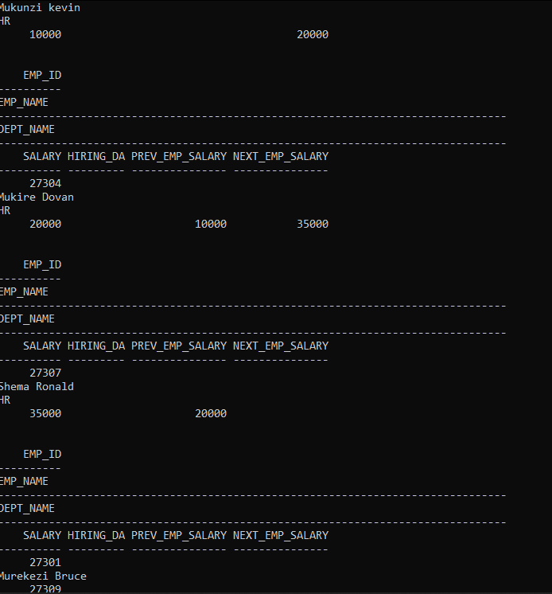

# SQL Window Functions Analysis

## Team Members
- [MIGISHA RWIHIMBA CHARITE]
- [NIRERE ANGELIQUE]

## Overview
This project demonstrates the use of SQL Window Functions to perform various analytical queries on an employee dataset. Window functions allow us to perform calculations across rows of data that are related to the current row, providing powerful analytical capabilities.

## Database Schema
We've created a simple employee database with the following structure:

```sql
CREATE TABLE Employees(
    emp_id INT PRIMARY KEY,
    emp_name VARCHAR(100) NOT NULL,
    dept_name VARCHAR(100) NOT NULL,
    salary DECIMAL(10,2),
    hiring_date DATE
);
```

Our dataset contains 14 employees across 3 departments (HR, IT, and Finance) with varying salaries and hiring dates.
## Window Functions Implemented

### 1. Compare Values with Previous or Next Records (LAG/LEAD)

This query compares each employee's salary with their previous and next colleagues within the same department.

```sql
SELECT e.*,
    LAG(salary) OVER (PARTITION BY dept_name ORDER BY emp_id) AS prev_emp_salary,
    LEAD(salary) OVER (PARTITION BY dept_name ORDER BY emp_id) AS next_emp_salary
FROM EMPLOYEES e;
```




We also created a version that labels whether each salary is higher, lower, or the same as the previous employee's salary:

```sql
SELECT e.*,
    LAG(salary) OVER (PARTITION BY dept_name ORDER BY emp_id) AS prev_emp_salary,
    CASE 
        WHEN e.salary > LAG(salary) OVER (PARTITION BY dept_name ORDER BY emp_id) THEN 'Higher than the previous employee'
        WHEN e.salary < LAG(salary) OVER (PARTITION BY dept_name ORDER BY emp_id) THEN 'Lower than the previous employee'
        WHEN e.salary = LAG(salary) OVER (PARTITION BY dept_name ORDER BY emp_id) THEN 'Same as previous employee'
    END sal_range
FROM EMPLOYEES e;
```
![part 2]](nm1.png) ![part 2]](nm2.png) ![part 2]](nm3.png) ![part 2]](nm4.png) ![part 2]](nm5.png)
**Explanation:** 
- `LAG()` looks at the previous row in the sorted partition
- `LEAD()` looks at the next row in the sorted partition
- The `PARTITION BY dept_name` ensures we're only comparing within the same department
- The `ORDER BY emp_id` determines the previous/next relationship

**Real-life Application:** This type of analysis is useful for tracking salary progression within departments, identifying salary disparities, and analyzing wage growth patterns.

 2. Ranking Data within a Category (RANK/DENSE_RANK)

This query demonstrates the difference between `RANK()` and `DENSE_RANK()` by ranking employees within each department based on their salaries.

```sql
SELECT e.*,
    RANK() OVER (PARTITION BY dept_name ORDER BY salary DESC) AS rnk,
    DENSE_RANK() OVER (PARTITION BY dept_name ORDER BY salary DESC) AS DENSE_rnk
FROM EMPLOYEES e;
```

**Explanation:**
- Both functions rank employees based on salary (highest to lowest) within each department
- `RANK()` leaves gaps in the ranking sequence when there are ties (e.g., 1, 2, 2, 4)
- `DENSE_RANK()` does not leave gaps when there are ties (e.g., 1, 2, 2, 3)

**Real-life Application:** These ranking functions help identify top performers in terms of compensation, facilitate salary benchmarking, and support compensation review processes.

 3. Identifying Top Records

This query retrieves the top 3 highest-paid employees from each department.

```sql
SELECT * FROM(
    SELECT e.*,
        RANK() OVER (PARTITION BY dept_name ORDER BY salary DESC) AS rnk
    FROM EMPLOYEES e) x
WHERE x.rnk <= 3;
```

**Explanation:**
- We first assign a rank to each employee within their department based on salary
- Then we filter to keep only the top 3 ranks from each department
- This handles tie cases appropriately, as `RANK()` will give the same rank to employees with identical salaries

**Real-life Application:** Companies often need to identify their highest-paid employees for compensation review, talent retention strategies, or budget planning.